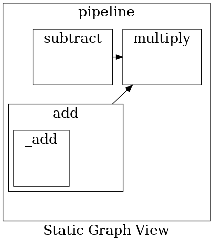
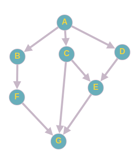

# TinyComputationGraph
Workflow orchestrators like [Airflow](https://airflow.apache.org/), [Kubeflow](https://www.kubeflow.org/), [Prefect](https://www.prefect.io/), Sematic, etc rely on creating computation graphs (DAGs to be precise) to execute Python functions. The concept of computation graphs is also used in popular DL libraries like PyTorch and TensorFlow.


**Main motivation:**  
I was using Kubeflow at work. As a workflow orchestrator, it excels in the reliability department but I hated the development experience of writing pipelines. It felt like it was getting in my way of writing Python code.

I wanted to explore the concept of computational graphs and an easier, flexible, non-obstructive way to create them.

# Features
1. Can create dynamic graphs in a nested fashion.
2. Can produce the static graph view of the functions via [networkx](https://networkx.org/documentation/stable/tutorial.html) or [pydot](https://github.com/pydot/pydot).
3. Can execute independent nodes in parallel, reducing the overall execution time of the program.

# Setup

```
> git clone https://github.com/nvinayvarma189/TinyComputationGraph
> cd TinyComputationGraph
> pyenv virtualenv 3.8.7 <env-name>
> pyenv activate <env-name>
> pip install -r requirements.txt
```

# Demo
## Graph Visualisation

```
python pipeline.py -gv pydot
```
The above command creates a DAG out of the `Node` decorated functions, resolves the DAG, and finally generates the below graph view using pydot.



Compare the below code snippet from the [`pipeline.py`](pipeline.py) file with the generated graph for a better understanding.

```python

@Node()
def _add(a, b):
    return a + b

@Node()
def add(a, b):
    return _add(a, b)

@Node()
def subtract(a, b):
    return a - b

@Node()
def multiply(a, b, c):
    return a * b * c

@Node()
def pipeline(a, b, c, d):
    add_future = add(a, b)
    subtract_future = subtract(c, d)
    multiply_future = multiply(add_future, c, subtract_future)
    return multiply_future

pipeline_future: Future = pipeline(10, 2, 5, 6)
pipeline_future.resolve()
```
**Explanation:**  
- Each box in the above graph image represents a node in the graph annotated with the function name. 
- Notice how `_add` is within `add` implying that the former is nested within the latter. Likewise, the `pipeline` node is the parent to all the other nodes. 
- Arrows from `subtract` and `add` towards `multiply` indicate that the `multiply` node takes the result of `subtract` and `add` as arguments.

Graph generation with networkx is also possible
```
python pipeline.py -gv nx
```

## Parallel Execution

Consider this code snippet (from [parallel_execution/pipeline.py](parallel_execution/pipeline.py))
```python
@Node()
def A(val):
    time.sleep(1)
    return val

@Node()
def B(a):
    time.sleep(1)
    return a

@Node()
def C(a):
    time.sleep(1)
    return a - 2

@Node()
def D(a):
    time.sleep(1)
    return a - 2

@Node()
def E(c, d):
    time.sleep(1)
    return c - d

@Node()
def F(b):
    time.sleep(1)
    return b * 10

@Node()
def G(f, c, e):
    time.sleep(1)
    return f + c - e

def main():
    a = A(10)
    b = B(a)
    c = C(a)
    d = D(a)
    e = E(c, d)
    f = F(b)
    g = G(f, c, e)
```
Each function from `A` to `G` takes ~1 sec to execute. When we resolve function `G` without any optimizations, the entire program would take ~7 sec to execute since it will execute all the 7 functions from `A` to `G` serially.

Here is a visualization of how the DAG would look like when we try to resolve the `G` function



Notice how `B`, `C`, and `D` do not need to wait for each other once `A` is resolved. Hence, these three functions can be executed in parallel.

```
python parallel_execution/pipeline.py
```
This will print the result of the graph and also the time it took to execute the entire program. 
```
Result after parallel execution:  108
Time taken to execute:  5.143002271652222
```
It took just ~5 seconds instead of ~7 seconds. The independent nodes have been executed in parallel :)

Note: It should've ideally taken ~4 seconds as `F` and `E` can also be executed in parallel as well.

# Todo

- [] Write basic tests
- [] Raise error if root function is not a `Node`
- [] Handle multiple return values from `Node` decorated functions
- [] Read about [TensorFlow graph optimizations](https://jonathan-hui.medium.com/tensorflow-eager-execution-v-s-graph-tf-function-6edaa870b1f1)
- [] Capture unreturned nodes
- [] Check for recursive functions and cycle creations
- [] Optimise parallel execution further with priority queues (ideally the [program](parallel_execution/pipeline.py) should take just ~4 sec)
- [] Better graph generation which is more intuitive