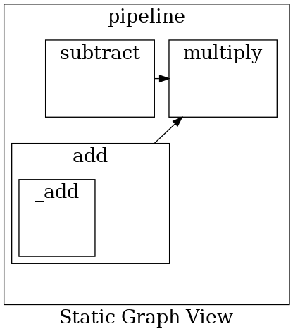

# TinyComputationGraph
Build computation graphs from python functions


## Graph Visualisation

`pipeline.py`
```python
from node import Node
from future import Future
from graph import graph

@Node()
def _add(a, b):
    return a + b

@Node()
def add(a, b):
    return _add(a, b)

@Node()
def subtract(a, b):
    return a - b

@Node()
def multiply(a, b, c):
    return a * b * c

@Node(verbose=False)
def pipeline(a, b, c, d):
    add_future = add(a, b)
    subtract_future = subtract(c, d)
    multiply_future = multiply(add_future, c, subtract_future)
    return multiply_future

pipeline_future: Future = pipeline(10, 2, 5, 6)
graph.visualize_graph()
```

When we run the pipeline.py (`python pipeline.py`) file, it produces the following static graph view of the computational graph

